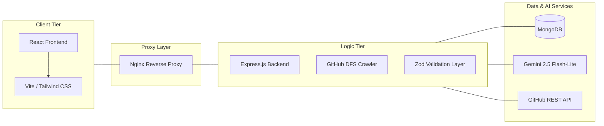

## Project Overview
## Project Overview
**OpenSource-Helper** is a technical analysis engine designed to bridge the gap between complex codebases and new contributors.

### ###  The Problem
Contributing to large-scale projects is often intimidating. Newcomers frequently struggle to:
* **Identify the true tech stack** beyond simple GitHub language tags.
* **Decipher architectural relationships** between backend and frontend logic in monorepos.
* **Find "Good First Issues"** that actually align with their specific skill level.

### ### The Solution
Our platform acts as a **"GPS for Repositories."** By processing a GitHub URL through a specialized pipeline, the system:
1. Performs a **recursive deep scan** of the codebase.
2. Analyzes the **architectural intent** using Gemini 2.5 Flash-Lite.
3. Generates a **structured roadmap** with actionable contribution steps.

## System Architecture

##  Design Decisions

   * **Recursive DFS vs. Flat Crawling** I implemented a **Depth-First Search (DFS) crawler** rather than a standard flat file-list fetch. This allows the system to prioritize architectural entry points...

  * **Schema Enforcement via Zod** To mitigate "AI hallucinations," I implemented a **Zod validation layer**...

  * **Security-First Reverse Proxy
    By using Nginx as a reverse proxy within a Docker bridge network, I’ve ensured that the Node.js runtime is never directly exposed. This architecture allows for centralized SSL termination and protects the internal API logic from common external vulnerabilities.

## Built With

This project utilizes a modern, containerized stack optimized for high-performance AI inference and type safety.

    Frontend: React 19, Vite, Tailwind CSS

    Backend: Node.js, Express 5, TypeScript

    AI Engine: Gemini 2.5 Flash-Lite (2026 Stable)

    Database & Cache: MongoDB, Redis (Planned)

    DevOps: Docker, Nginx Reverse Proxy

    Validation: Zod (Runtime Schema Enforcement)

##  Getting Started

To get a local copy up and running, follow these steps.
### Prerequisites
    Docker & Docker Compose
    GitHub Personal Access Token (Classic)
    Google Gemini API Key

### Installation & Setup

    Clone the repo

    git clone https://github.com/kartikmanwani/OpenSource-Helper.git

    Configure Environment Variables
    Create a .env file in the root directory:
    Code snippet

    GEMINI_API_KEY=your_key_here
    GITHUB_TOKEN=your_pat_here
    MONGO_URI=mongodb://helper-db:27017/opensource-helper

    Spin up the containers
    docker-compose up --build

    The app will be available at http://localhost via the Nginx proxy.

##  Testing

 testing suite using Playwright to ensure the reliability of the analysis pipeline and the stability of the UI.
### API Integration Testing

The core analysis logic is validated through end-to-end API tests. This includes:

    Successful Analysis: Validating that the DFS crawler and Gemini AI return a 200 OK within the 100s timeout window.

    Schema Validation: Ensuring the AI's JSON output perfectly matches our Zod definitions.

    Error Handling: Verifying 404 responses for non-existent repositories.

### Running Tests
 

# Run all tests in a serial environment to prevent DB collisions
npx playwright test --workers=1
 

## Usage

    Login: Authenticate via GitHub to provide the system with the necessary scope to read your target repositories.

    Input: Paste the URL of any public GitHub repository or specific Issue.

    Process: The system performs a DFS crawl to extract architectural context.

    Result: View your personalized "Contribution Roadmap," including tech-stack breakdowns and actionable implementation steps.
 
